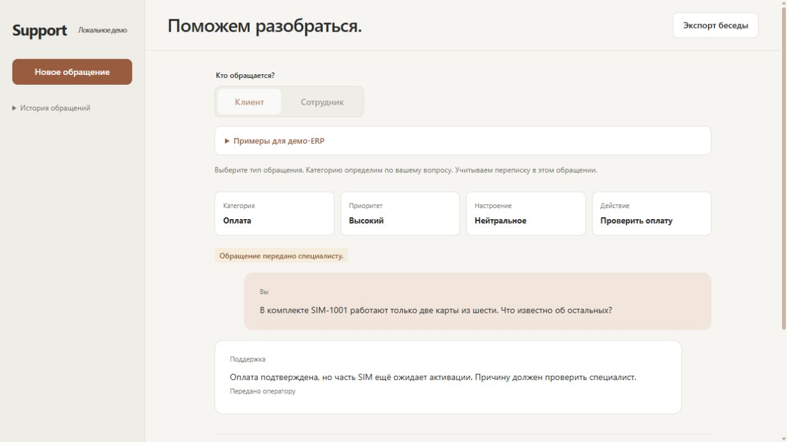
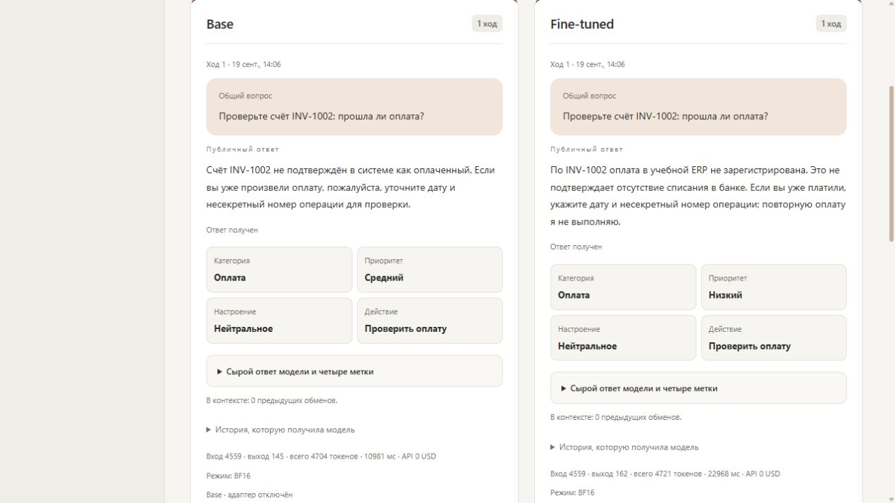
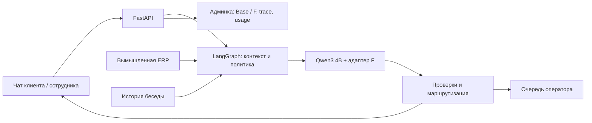

# AI Customer Support Manager

Русскоязычный локальный помощник поддержки SaaS/ERP/телекома. Два контура: удобный чат для клиента или сотрудника и админка для сравнения моделей, истории, трейсинга и очереди оператора.

Учебный capstone-проект. Все ERP-объекты вымышлены; интеграции с реальными корпоративными системами нет. Модель работает локально на GPU, платные API не используются.



## Возможности

- Категория, приоритет, настроение, рекомендуемое действие и ответ по политике компании.
- История диалога и отдельные контексты клиента/сотрудника.
- Проверка вымышленных счетов, SIM и доступов; серверная маршрутизация в локальную очередь оператора.
- Защита от бессмысленных повторных отправок и понятный статус обработки.
- Base и Fine-tuned рядом: ответы, метки, решение модели и сервера, реальные токены и время.
- Локальный LangGraph trace и сохранённые агрегаты качества.



## Стек и устройство

Python 3.11 · FastAPI · HTML/CSS/JavaScript · LangGraph · PyTorch · Transformers · PEFT/QLoRA · Qwen3-4B-Instruct-2507.



Один локальный сервер обслуживает обе страницы. Одна Base-модель на GPU; в режиме сравнения адаптер F включается или отключается. UI текущей версии — HTML/JS; Gradio сохранился в общем lock зависимостей от ранних этапов.

## Результат обучения

Финальный F обучен с чистой Base: **430 синтетических TRAIN-диалогов / 1 113 целевых ответов / 13 локальных шардов**, NF4 QLoRA, rank 16, alpha 32, 2 эпохи, 558 optimizer steps.

**Base 10/100 → F 49/100 полностью успешных диалогов** — описательная AI-оценка синтетического **development**, NF4, статус **QUALIFIED**. Это не итоговый закрытый test и не человеческая проверка; formal `full_success_rate=null`. Live-демо работает в BF16. Подробности и ограничения: [результат F](docs/CANDIDATE_F_RESULTS.md), [карточка данных](docs/DATASET_FINAL_F.md), [методы разметки](docs/DATASET_METHODS_V13.md).

На малом ручном прогоне: 5 сообщений / 4 беседы, 23 767 токенов, API 0 USD, генерация 17–31 с. Это не SLA; отсутствие эскалации не доказывает разрешение обращения. Экономия труда и полная себестоимость не измерены. [Бизнес-метрики](reports/business-metrics.md).

## Установка и запуск

Проверено локально на Windows / RTX 3080 Laptop 16 ГБ. Нужны Python 3.11, совместимый NVIDIA-драйвер, Base и отдельный адаптер F. В этом репозитории весов и полного TRAIN нет.

1. [Пошаговый запуск через Docker](docs/DOCKER_TUTORIAL.md): сборка, загрузка весов, GPU, запуск и остановка.
2. [GitHub + Hugging Face и альтернативный Windows venv](docs/PUBLISHING.md).
3. [Состав ML-пакетов](docs/ML_ASSETS.md).

Docker image собран и запущен на RTX 3080 Laptop 16 ГБ; проверены две связанные реплики и сохранение беседы после пересоздания контейнера. Для native Windows после установки зависимостей и загрузки весов по инструкции:

```powershell
.\.venv\Scripts\python.exe -X utf8 -B scripts/live_demo.py start --adapter-profile quality-f --precision bf16 --attention sdpa_repeat_kv
Invoke-RestMethod http://127.0.0.1:7860/health
```

Дождаться `loaded=true`, затем открыть [чат](http://127.0.0.1:7860/client/) или [админку](http://127.0.0.1:7860/admin/). Остановка:

```powershell
.\.venv\Scripts\python.exe -X utf8 -B scripts/live_demo.py stop
.\.venv\Scripts\python.exe -X utf8 -B scripts/live_demo.py status
```

Дождитесь статуса `stopped`, подтверждающего завершение сервера. Переписка, состояния процессов и checkpoints не включены в Git.

## Материалы проекта

- [Что это за проект: задача, сценарии, архитектура и границы результата](docs/PROJECT_OVERVIEW.md).

- [Презентация PowerPoint: 15 слайдов, реальные скриншоты](deliverables/presentation/AI-Customer-Support-Manager-v3.pptx).
- [Презентация PDF](deliverables/presentation/AI-Customer-Support-Manager.pdf).
- [Демо-ERP](docs/DEMO_ERP.md), [состав сдачи](docs/SUBMISSION_CHECKLIST.md).
- [Конфигурация F](configs/train-quality90-f-v13-audited-labels.json); `scripts/train_quality_candidate.py` и `scripts/quality_training_control.py` — код обучения и безопасных сессий.
- Технические CPU-тесты в `tests/`; автоматические проверки не загружают веса и не запускают обучение.

## Границы версии

Опубликованы публичные Hugging Face [Model](https://huggingface.co/AkanaYB/saas-erp-support-qwen3-4b-adapter-f) и [Dataset](https://huggingface.co/datasets/AkanaYB/saas-erp-support-ru-train-v13). Публикация подтверждена 19 сентября 2026: Model `b0862d45d6a2bf71eb1578ac8ca91cdf6e5d5986`, Dataset `b110d85782245c6678ff278ab23b6738b06c1622`. Загрузчик использует закреплённые commit SHA из `configs/asset-sources.json`; [получение пакетов](docs/PUBLISHING.md), [границы проверки Docker](docs/DOCKER_VERIFICATION.md). Чистая установка на другом компьютере и полный повтор исторического обучения не проверены. Для повторения обучения кроме TRAIN нужна отдельная квитанция изоляции; код не обходит эту проверку. Защищённые dev/test/gold и индивидуальные оценки не публикуются.

GitHub-публикация не запускает сайт в интернете. Здесь нет production-аутентификации, SaaS-биллинга или подключения к реальной ERP; общие демо-роли предназначены для локального показа. RAG и числовой confidence отложены.

Лицензия Base — Apache-2.0. Лицензия собственного кода, адаптера и датасета ещё не выбрана; публикация исходников не является предоставлением коммерческих прав на весь проект.
